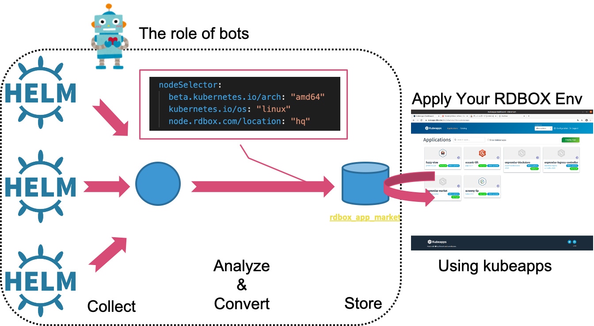

# RDBOX App Market (This repository manages the chart generator.)

The RDBOX App Market is a platform to easily add cloud-native applications to your RDBOX environment to help you develop service robots and IoT devices.

</img>

## Feature

The biggest feature. Collects third-party Helm chart repositories and adds settings adapted to the RDBOX environment.  
It automatically adds the best nodeSelector to the collected charts. This is a necessary consideration for RDBOX environments with a mixture of different CPU architectures such as amd64, armhf and arm64. The converted chart is available on the [rdbox\-intec/rdbox\_app\_market](https://github.com/rdbox-intec/rdbox_app_market)  

In addition to nodeSelector, the bot also automatically sets [Persistent Volumes](https://kubernetes.io/docs/concepts/storage/persistent-volumes/), [Ingress](https://kubernetes.io/docs/concepts/services-networking/ingress/), DNS, etc. that are provided as standard in the RDBOX environment.  

The charts we provide are not limited to automatically converted third party charts. It also includes Helm charts we manage. The RDBOX App Market also provides charts for directly moving service robots and IoT devices and charts that are difficult to automatically convert.  

## **NOTICE**

Our bot is not perfect. The bot cannot change all settings correctly.  
When applying a convenient app to your RDBOX environment, **please check the settings yourself.**  

## Referred to

### third-party

- [bitnami/charts](https://github.com/bitnami/charts)
- [helm/charts](https://github.com/helm/charts)
  - stable
  - incubator

### Created by us manually (Your PR is welcome.)

- [rdbox\-intec/helm\_chart\_for\_rdbox](https://github.com/rdbox-intec/helm_chart_for_rdbox)
